## はじめに

みなさん、**SKILL.md** って使ってますか？

GitHub Copilot の Agent Mode を触り始めてから、「スキルファイル」という概念を知ったんですが、正直なところ最初は「どこから持ってくるの？」「自分で全部書くの？」って状態でした。※Skillsもやまぱんさんのコミュニティの発表で知りました。

そんなとき、尊敬している [@yamapan](https://github.com/aktsmm) さんが作られた **Agent Skills Ninja** という VS Code 拡張機能を知りました。スキルの検索・インストール・管理をまるっとやってくれるやつです。

実際に使ってみたら「これ、めちゃくちゃ便利じゃん…」ってなったので、触ってみた記録として残しておきます。

:::note info
この記事は Agent Skills Ninja v0.8.28 時点の内容です（2026 年 5 月）。
:::

## そもそも SKILL.md って何？

まず軽く背景を。

GitHub Copilot の Agent Mode では、**SKILL.md** という Markdown ファイルをプロジェクトに置いておくと、エージェントがそれを読み込んで振る舞いをカスタマイズしてくれます。

たとえばこんな感じです。

```markdown
# Azure Bicep スキル

## When to Use

Bicep テンプレートの作成・レビューを依頼されたとき

## 手順

1. リソースの種類と要件を確認する
2. 既存テンプレートとの整合性をチェックする
3. パラメータ・変数・出力を定義する
```

このファイルを `.github/skills/qiita-article/SKILL.md` に置いておくと、「Qiita 記事書いて」と頼んだときにエージェントが自動で読んで動いてくれます。

**でも問題がありまして。**

Anthropic、OpenAI、Microsoft、GitHub など、各社がスキルを公開してるんですが、それが複数のリポジトリに散らばってて、手動で探してダウンロードするのが地味にしんどい。
そこで登場するのが Agent Skills Ninja です。

## インストールをしてみる

`Ctrl+Shift+X` で拡張機能パネルを開いて `Agent Skills Ninja` で検索するだけです。

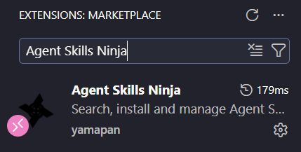
_VS Code Marketplace で "Agent Skills Ninja" を検索したところ_

または、コマンドパレット（`Ctrl+Shift+P`）から直接インストールもできます。

```
ext install yamapan.agent-skill-ninja
```

インストールしたら、アクティビティバーにかっこいい手裏剣アイコンが追加されました。

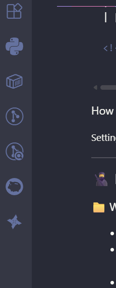
_左端に手裏剣が現れます_

## サイドバーを開くと

手裏剣アイコンをクリックすると、サイドバーが開きます。

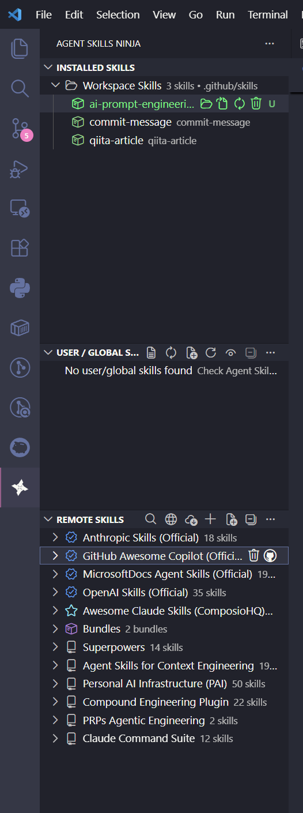
_3 つのセクションに整理されていてわかりやすい_

こんな感じで 3 つのセクションに分かれています。

| セクション                       | 内容                                            |
| -------------------------------- | ----------------------------------------------- |
| **インストール済みスキル**       | ワークスペースの `.github/skills/` 配下のスキル |
| **ユーザー / グローバル スキル** | `~/.copilot/skills` などの個人スキル            |
| **Remote Skills**                | Official・Curated・Community のリモートスキル   |

最初は全部空っぽですが、Remote Skills のところに公式リポジトリのスキルが並ぶのを見てテンション上がりました。

## 実際にスキルを検索してみる

さっそく `Ctrl+Shift+P` → `Agent Skills Ninja: Search Skills` でスキルを検索してみます。

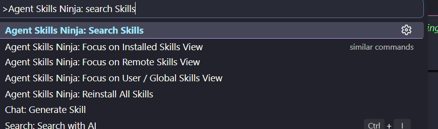
_シンプルな検索ボックスが出てきます_

`azure` と入力してみると…

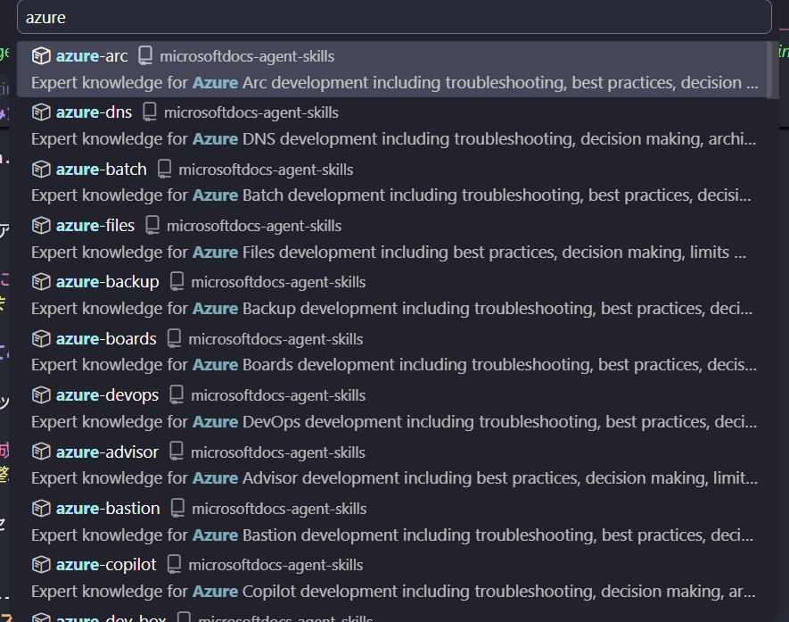
_Azure 関連のスキルがズラッと並ぶ！Official バッジが付いてるものは公式リポジトリから_

スター数や公式バッジが見えるのがいいですね。信頼度を判断しやすいです。

検索のコツとして、こういう書き方ができます。

| 入力例            | 効果                               |
| ----------------- | ---------------------------------- |
| `azure`           | キーワード検索                     |
| `azure devops`    | 複数キーワード、関連度でランキング |
| `user:anthropics` | Anthropic のスキルだけ探す         |
| `repo:owner/repo` | リポジトリ直指定                   |

0 件だった場合はキーワードを減らして自動リトライしてくれるのも地味に助かります。

## ワンクリックでインストール！

スキルを選択するとアクション選択が出てきます。**Install** を選ぶだけです。

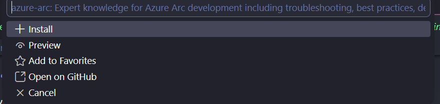
_Install / Preview / Favorite / GitHub の 4 択が出る_

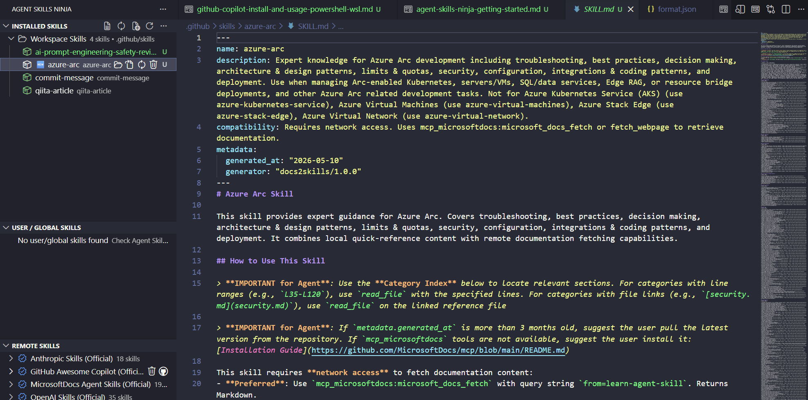
_インストールした azure-arc スキルの SKILL.md がエディタで開かれる。中身がしっかり入ってる！_

インストールが終わると `.github/skills/<スキル名>/SKILL.md` が自動で作られて、さらに `AGENTS.md`（または `copilot-instructions.md`）にこういう記述が自動追記されます。

```markdown
<!-- skill-ninja-START -->

## Agent Skills

> **IMPORTANT**: Prefer skill-led reasoning over pre-training-led reasoning.
> Read the relevant SKILL.md before working on tasks covered by these skills.

### Skills

| Skill                                                | Description                                                   |
| ---------------------------------------------------- | ------------------------------------------------------------- |
| [azure-devops](.github/skills/azure-devops/SKILL.md) | Azure DevOps operations. Use for pipelines, repos, work items |

<!-- skill-ninja-END -->
```

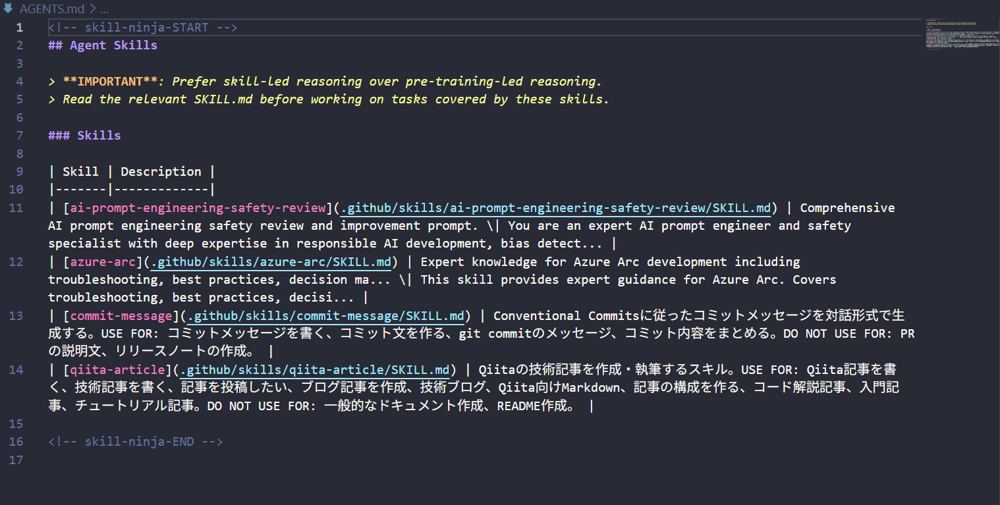
_実際の AGENTS.md。skill-ninja-START〜END の間にスキルの一覧が入ってる_

この `IMPORTANT` プロンプトがポイントで、これがあるとエージェントが事前学習の知識よりもスキルファイルを優先して読み込んでくれます。手動でこれを書くの忘れてたなぁ…と反省しました。

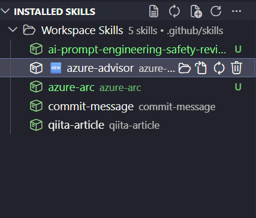
_インストール直後は NEW バッジが付いてわかりやすい_

## Copilot Chat の @skill コマンドも試してみた

`@skill` という Chat 拡張コマンドが追加されていて、会話からスキルを操作できます。

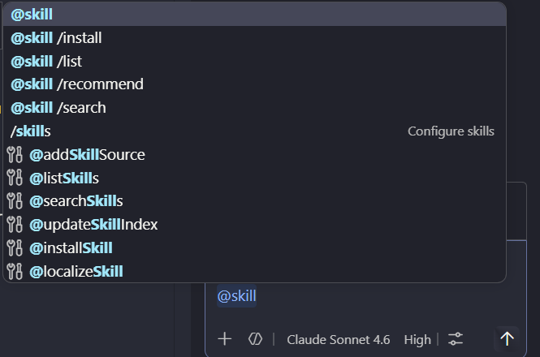
_チャット欄に @skill と打つとコマンド一覧が出てくる_

```
@skill /search MCP server      # スキル検索
@skill /install github-mcp     # インストール
@skill /list                   # 一覧表示
@skill /recommend              # プロジェクトに合ったスキルを推薦
```

`/recommend` がけっこう面白くて、プロジェクトの内容を見てスキルを提案してくれます。実際に試したら「このリポジトリには Azure 関連スキルが合いそうです」みたいな感じで出てきました。

## Agent Mode だとさらに便利だった

GitHub Copilot の Agent Mode では、Agent Skills Ninja が MCP ツールとして自動認識されます。つまり、こんな会話ができます。

```
💬 "Azure 関連のスキルを探して"
   → #searchSkills が自動で呼ばれて結果を表示してくれる

💬 "bicep-mcp スキルをインストールして"
   → #installSkill でインストール、instruction ファイルも自動更新

💬 "このプロジェクトにおすすめのスキルは？"
   → #recommendSkills でワークスペースを分析して推薦
```

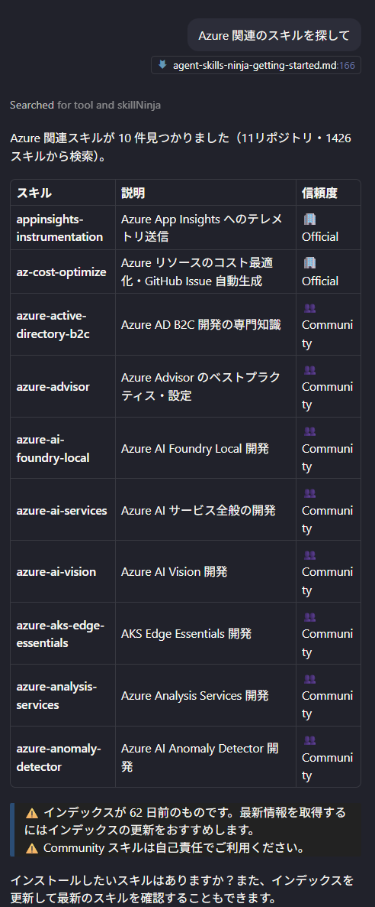
_「Azure 関連のスキルを探して」と頼んだら 10 件ズラッと出てきた_

利用可能な MCP ツールはこの 8 つです。

| ツール              | 何をするか                 |
| ------------------- | -------------------------- |
| `#searchSkills`     | キーワードでスキル検索     |
| `#installSkill`     | スキルをインストール       |
| `#uninstallSkill`   | スキルをアンインストール   |
| `#listSkills`       | インストール済みスキル一覧 |
| `#recommendSkills`  | プロジェクトに合った推薦   |
| `#updateSkillIndex` | スキルインデックスを更新   |
| `#webSearchSkills`  | GitHub でスキルを Web 検索 |
| `#addSkillSource`   | 新しいスキルソースを追加   |

## ハマったポイント：GitHub Token が必要

最初、スキルを検索しようとしたら検索が全然ヒットしなくて「あれ？」ってなりました。

原因は **GitHub Token が未設定**だったことです。設定していないと API のレート制限（60 リクエスト/時間）にすぐ引っかかって検索が失敗します。これは README にも書いてありますが、見落としてしまいました…

:::note warn
**GitHub Token は検索機能に必須です。** 先に設定してから使い始めましょう。
:::

### GitHub CLI があれば一番楽

```bash
gh auth login
```

これだけで自動的にトークンを拾ってきてくれます。設定ファイルへの入力も不要です。

### settings.json に直接書く場合

```json
{
  "skillNinja.githubToken": "ghp_xxxxxxxxxxxx"
}
```

Token は [こちら](https://github.com/settings/tokens/new?description=Agent%20Skill%20Ninja&scopes=repo,read:org) から作成できます（スコープ: `repo`, `read:org`）。

## プリセットのスキルソースが充実していた

デフォルトでこれだけのソースが入っています。

| ソース                                              | タイプ    | 内容                                 |
| --------------------------------------------------- | --------- | ------------------------------------ |
| anthropics/skills                                   | Official  | Anthropic 公式 Claude Skills         |
| openai/skills                                       | Official  | OpenAI 公式 Codex Skills（1,700+！） |
| github/awesome-copilot                              | Official  | GitHub 公式 Copilot リソース         |
| MicrosoftDocs/Agent-Skills                          | Official  | Microsoft 公式 Azure Agent Skills    |
| ComposioHQ/awesome-claude-skills                    | Curated   | Claude Skills キュレーションリスト   |
| obra/superpowers                                    | Community | 高品質スキル・エージェント集         |
| muratcankoylan/Agent-Skills-for-Context-Engineering | Community | Context Engineering スキル（5,000+） |

特に OpenAI の 1,700+ スキルと Context Engineering の 5,000+ スキルはボリュームがすごかったです。

`Update Index` コマンドを叩くと最新情報に更新されます。

## 設定まわり

一部設定だけ紹介しておきます。

| 設定キー                     | デフォルト       | メモ                                           |
| ---------------------------- | ---------------- | ---------------------------------------------- |
| `skillNinja.instructionFile` | `AGENTS.md`      | `copilot-instructions.md` などに変えることも可 |
| `skillNinja.skillsDirectory` | `.github/skills` | スキルの保存先                                 |
| `skillNinja.outputFormat`    | `full`           | `compact` にするとトークン節約になる           |
| `skillNinja.language`        | `auto`           | 日本語 UI に自動対応してくれる                 |

### 出力フォーマットについて

instruction ファイルへの書き出し形式を 3 種類から選べます。

| フォーマット | 内容                                               | いつ使う                       |
| ------------ | -------------------------------------------------- | ------------------------------ |
| `full`       | IMPORTANT プロンプト + 詳細テーブル（200文字）     | デフォルトでこれでOK           |
| `compact`    | IMPORTANT プロンプト + 圧縮インデックス（100文字） | コンテキスト長を節約したいとき |
| `legacy`     | シンプルテーブルのみ（IMPORTANT なし）             | 後方互換が必要なとき           |

スキルが増えてきたら `compact` に切り替えるのが良さそうです。

## まとめ

使う前は「スキル管理ツールってそんなに変わらんでしょ」と思っていましたが、実際に触ってみたらかなり体験が変わりました。

**特によかった点：**

- ワンクリックインストールで `AGENTS.md` まで自動更新してくれる
- Agent Mode から会話でスキルの検索〜インストールができる
- 公式・Curated・Community のスキルが一元管理されていてすぐ探せる
- 日本語 UI 対応なのでとっつきやすい

**注意点：**

- GitHub Token は使い始める前に必ず設定する
- スキルが増えてきたら `compact` フォーマットへの切り替えを検討

スキルが増えるほど Copilot との協働が深まってくる感じがあって、触っていて楽しかったです。やまぱんさん、素晴らしい拡張機能をありがとうございます！

## 参考

- [Agent Skills Ninja - VS Code Marketplace](https://marketplace.visualstudio.com/items?itemName=yamapan.agent-skill-ninja)
- [aktsmm/vscode-agent-skill-ninja - GitHub](https://github.com/aktsmm/vscode-agent-skill-ninja)
- [README (日本語)](https://github.com/aktsmm/vscode-agent-skill-ninja/blob/master/README_ja.md)
- [Agent Resources Ninja - VS Code Marketplace](https://marketplace.visualstudio.com/items?itemName=yamapan.agent-resources-ninja)
- [MicrosoftDocs/Agent-Skills - GitHub](https://github.com/MicrosoftDocs/Agent-Skills)
