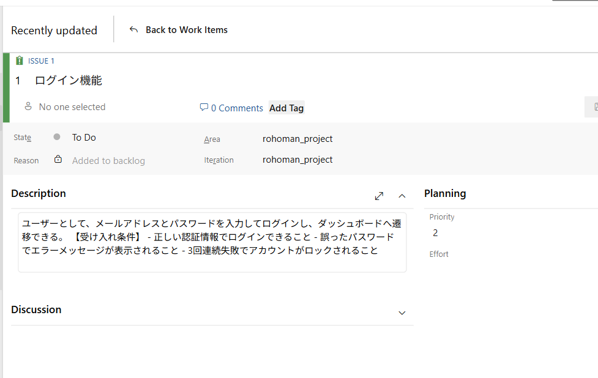
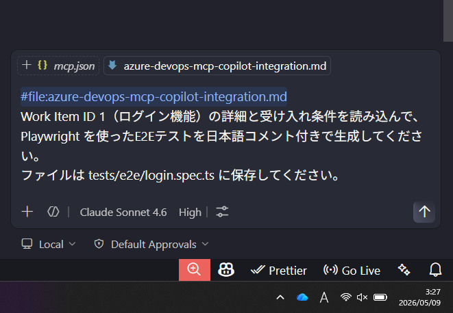
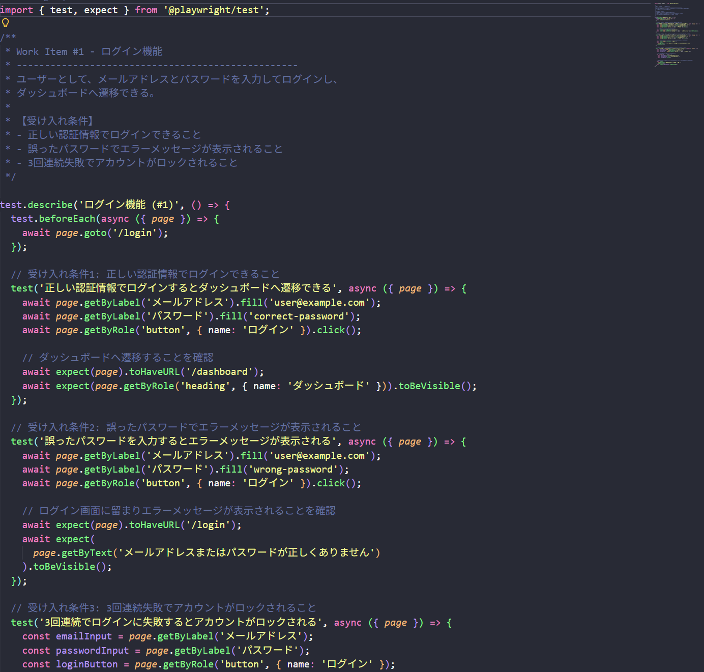
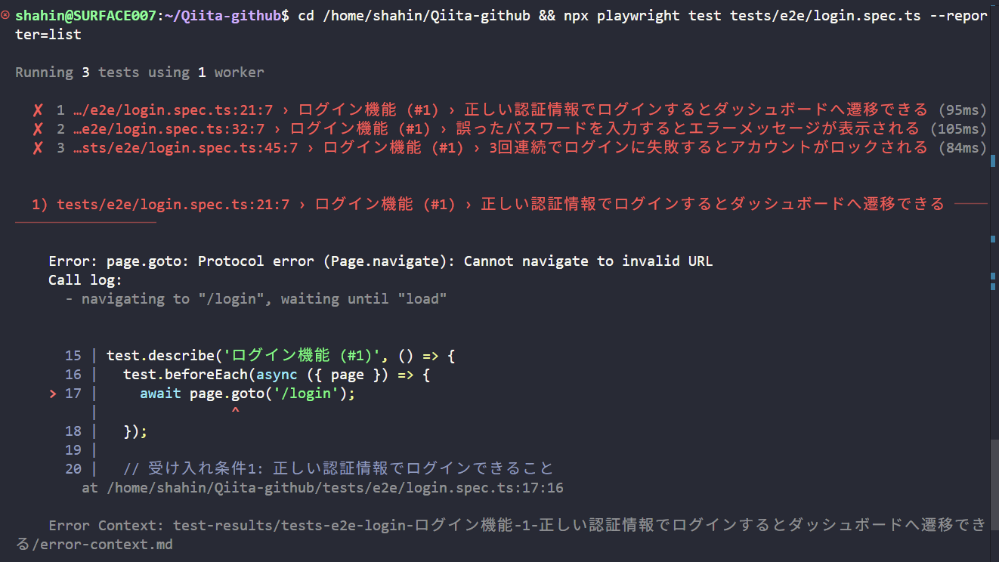
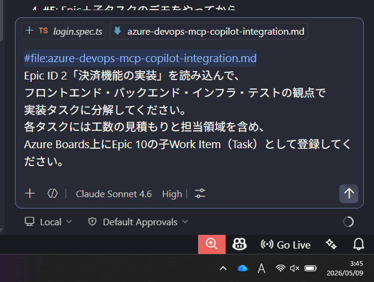
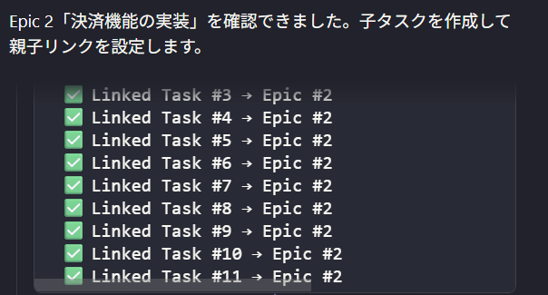
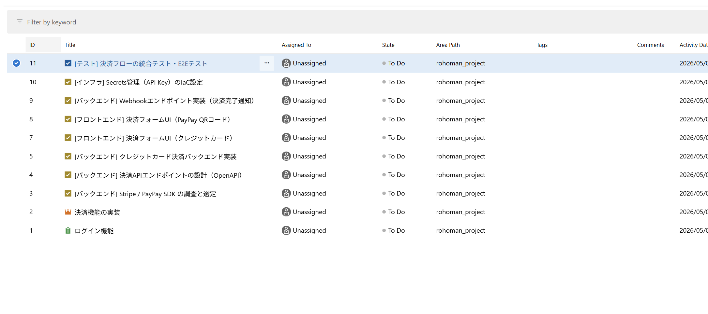

## はじめに

「チケットを書いたら、あとはAIがやってくれる」——そんな世界が現実になりつつあります。

**Model Context Protocol（MCP）** を使うと、GitHub CopilotとAzure DevOps（Azure Boards）を高度に連携させ、バックログのユーザー・ストーリーをAIが読み込んで **テストケースを自動生成** したり、巨大なタスクを **実装可能な子タスクへ自動細分化** したりできます。

この記事では、具体的なセットアップ手順と活用パターンを紹介します。

この記事を読むと、以下のことができるようになります：

- ✅ GitHub CopilotからAzure DevOps（Boards）をMCP経由で操作する
- ✅ ユーザー・ストーリーからE2Eテストケースを自動生成する
- ✅ 大きなタスクを実装ステップに自動分解してボードに展開する

---

## 前提条件・環境

| 項目           | バージョン / 備考              |
| -------------- | ------------------------------ |
| GitHub Copilot | Business / Enterprise プラン   |
| VS Code        | 最新版（MCP拡張対応）          |
| Azure DevOps   | クラウド版（Azure Boards有効） |
| Node.js        | v20以上（MCPサーバー実行用）   |

:::note info
💡 **MCPとは？**  
Model Context Protocol（MCP）は、AIモデルが外部ツールやデータソースと標準化された方法でやりとりするためのオープンプロトコルです。GitHub CopilotはVS Code上でMCPサーバーへ接続でき、Azure DevOpsをはじめとした各種ツールをCopilotの「手足」として使えます。
:::

---

## 全体アーキテクチャ

```
┌─────────────────────────────────────────────┐
│              開発者の操作                    │
│  「このユーザー・ストーリーのテストを作って」 │
└────────────────┬────────────────────────────┘
                 │
                 ▼
┌─────────────────────────────────────────────┐
│          GitHub Copilot (VS Code)            │
│  - プロンプトを解析                          │
│  - MCPツールを選択・呼び出し                 │
└────────────────┬────────────────────────────┘
                 │ MCP プロトコル
                 ▼
┌─────────────────────────────────────────────┐
│        Azure DevOps MCP サーバー             │
│  - Azure Boards API をラップ                 │
│  - Work Item の読み書き                      │
└────────────────┬────────────────────────────┘
                 │ REST API
                 ▼
┌─────────────────────────────────────────────┐
│            Azure DevOps                      │
│  - Azure Boards（バックログ・スプリント）     │
│  - Work Items（Epic / Feature / Story / Task）│
└─────────────────────────────────────────────┘
```

---

## Step 1: Azure DevOps MCP サーバーのセットアップ

### 1-1. MCPサーバーのインストール

```bash
npm install -g @azure-devops/mcp-server
```

または、VS Codeの設定（`settings.json`）に直接記述することもできます（後述）。

### 1-2. Azure DevOps Personal Access Token（PAT）の取得

Azure DevOpsポータルで以下のスコープを持つPATを発行します。

| スコープ                  | 理由                   |
| ------------------------- | ---------------------- |
| Work Items (Read & Write) | チケットの読み書き     |
| Project and Team (Read)   | プロジェクト情報の取得 |

:::note warn
⚠️ **PATは環境変数で管理してください。**  
コードやsettings.jsonにハードコードしないよう注意しましょう。
:::

```bash
export AZURE_DEVOPS_PAT="<あなたのPATトークン>"
export AZURE_DEVOPS_ORG="https://dev.azure.com/<組織名>"
```

### 1-3. VS Code の MCP 設定

`.vscode/mcp.json`（またはユーザー設定）にサーバー設定を追加します。

```json:.vscode/mcp.json
{
  "servers": {
    "azure-devops": {
      "type": "stdio",
      "command": "npx",
      "args": ["-y", "@azure-devops/mcp-server"],
      "env": {
        "AZURE_DEVOPS_PAT": "${env:AZURE_DEVOPS_PAT}",
        "AZURE_DEVOPS_ORG": "${env:AZURE_DEVOPS_ORG}"
      }
    }
  }
}
```

VS Codeを再起動すると、Copilotのチャット画面でMCPツールが利用可能になります。

---

## ユースケース1: ユーザー・ストーリーからテストを自動生成する

### シナリオ

Azure Boardsに次のようなIssueが登録されているとします。



> **Issue #1: ログイン機能**  
> ユーザーとして、メールアドレスとパスワードを入力してログインし、ダッシュボードへ遷移できる。  
> 受け入れ条件：
>
> - 正しい認証情報でログインできること
> - 誤ったパスワードでエラーメッセージが表示されること
> - 3回連続失敗でアカウントがロックされること

### Copilotへのプロンプト例



```
#azure-devops
Work Item ID 1（ログイン機能）の詳細と受け入れ条件を読み込んで、
Playwright を使ったE2Eテストを日本語コメント付きで生成してください。
ファイルは tests/e2e/login.spec.ts に保存してください。
```

### Copilotが生成するテストコード例



```typescript:tests/e2e/login.spec.ts
import { test, expect } from '@playwright/test';

// US-42: ログイン機能 - 受け入れ条件に基づくE2Eテスト

test.describe('ログイン機能', () => {
  test('正しい認証情報でログインできること', async ({ page }) => {
    await page.goto('/login');
    await page.getByLabel('メールアドレス').fill('user@example.com');
    await page.getByLabel('パスワード').fill('correct-password');
    await page.getByRole('button', { name: 'ログイン' }).click();

    // ダッシュボードへ遷移することを確認
    await expect(page).toHaveURL('/dashboard');
    await expect(page.getByText('ようこそ')).toBeVisible();
  });

  test('誤ったパスワードでエラーメッセージが表示されること', async ({ page }) => {
    await page.goto('/login');
    await page.getByLabel('メールアドレス').fill('user@example.com');
    await page.getByLabel('パスワード').fill('wrong-password');
    await page.getByRole('button', { name: 'ログイン' }).click();

    // エラーメッセージの表示を確認
    await expect(
      page.getByText('メールアドレスまたはパスワードが正しくありません')
    ).toBeVisible();
    await expect(page).toHaveURL('/login');
  });

  test('3回連続失敗でアカウントがロックされること', async ({ page }) => {
    await page.goto('/login');
    const emailInput = page.getByLabel('メールアドレス');
    const passwordInput = page.getByLabel('パスワード');
    const loginButton = page.getByRole('button', { name: 'ログイン' });

    // 3回失敗させる
    for (let i = 0; i < 3; i++) {
      await emailInput.fill('user@example.com');
      await passwordInput.fill('wrong-password');
      await loginButton.click();
    }

    // ロックメッセージの表示を確認
    await expect(
      page.getByText('アカウントがロックされました')
    ).toBeVisible();
    await expect(loginButton).toBeDisabled();
  });
});
```

:::note info
💡 **ポイント**: Copilotは `#azure-devops` のMCPツールを通じてWork ItemのIDと説明・受け入れ条件を取得し、それをコンテキストとしてテストを生成します。Work Itemが更新されたら同じプロンプトを再実行するだけでテストも更新されます。
:::

生成されたテストをPlaywrightで実行した結果です。実際のアプリがなくても、テスト名（日本語）が正しく認識されていることが確認できます。



---

## ユースケース2: 大きなタスクを実装ステップへ自動細分化する

### シナリオ

次のような抽象的なEpicチケットが登録されているとします。

> **Epic #2: 決済機能の実装**  
> クレジットカードとPayPayによる決済を実装する。

このチケット1枚だけでは担当者が何から手をつけるか分かりません。Copilotに細分化を依頼しましょう。

### Copilotへのプロンプト例



```
#azure-devops
Epic ID 2「決済機能の実装」を読み込んで、
フロントエンド・バックエンド・インフラ・テストの観点で
実装タスクに分解してください。
各タスクには工数の見積もりと担当領域を含め、
Azure Boards上にEpic 2の子Work Item（Task）として登録してください。
```

### Copilotが生成・登録するタスク例

Copilotが親子リンクの設定まで完了した様子です。



Azure Boards上のWork Items一覧でEpic #2と子タスクが登録されています。



Copilotは以下のような子タスクを自動生成し、Azure Boards上にEpic #2の子アイテムとして作成します。

| #        | タスク名                                  | 領域           | Story Points |
| -------- | ----------------------------------------- | -------------- | ------------ |
| TASK-101 | Stripe / PayPay SDK の調査と選定          | バックエンド   | 2            |
| TASK-102 | 決済APIエンドポイントの設計（OpenAPI）    | バックエンド   | 3            |
| TASK-103 | クレジットカード決済バックエンド実装      | バックエンド   | 5            |
| TASK-104 | PayPay決済バックエンド実装                | バックエンド   | 5            |
| TASK-105 | 決済フォームUI（クレジットカード）        | フロントエンド | 3            |
| TASK-106 | 決済フォームUI（PayPay QRコード）         | フロントエンド | 3            |
| TASK-107 | Webhookエンドポイント実装（決済完了通知） | バックエンド   | 3            |
| TASK-108 | Secrets管理（API Key）のIaC設定           | インフラ       | 2            |
| TASK-109 | 決済フローの統合テスト・E2Eテスト         | テスト         | 5            |

### 裏側でCopilotが実行しているMCP操作

```
1. get_work_item(id=2)           → Epic #2の詳細を取得
2. 分解ロジック実行               → タスクリストを生成
3. create_work_item × 9回        → 各タスクをBoardsに登録
4. update_work_item_link × 9回   → Epic #2との親子リンクを設定
```

---

## 応用: GitHub Actions との組み合わせ

スプリント開始時に自動でタスク細分化を実行するCI/CDパイプラインも組めます。

```yaml:.github/workflows/sprint-planning.yml
name: Sprint Planning Automation

on:
  schedule:
    # 毎スプリント開始日（月曜 9:00 JST）に自動実行
    - cron: '0 0 * * 1'
  workflow_dispatch:

jobs:
  breakdown-tasks:
    runs-on: ubuntu-latest
    steps:
      - uses: actions/checkout@v4

      - name: Run Copilot Task Breakdown via MCP
        uses: github/copilot-cli-action@v1
        with:
          prompt: |
            Azure Boards から今スプリントの "New" 状態の Feature を全て取得し、
            子タスクがないものを実装タスクに細分化して登録してください。
        env:
          AZURE_DEVOPS_PAT: ${{ secrets.AZURE_DEVOPS_PAT }}
          AZURE_DEVOPS_ORG: ${{ vars.AZURE_DEVOPS_ORG }}
          GH_TOKEN: ${{ secrets.GITHUB_TOKEN }}
```

:::note warn
⚠️ **注意**: 自動登録は便利ですが、AIが生成したタスクは必ずスプリントプランニングで人間がレビューしてから承認するフローを設けることを推奨します。
:::

---

## トラブルシューティング

### Q: CopilotがMCPツールを認識しない

**A**: VS Codeのバージョンとmcp.jsonの構文を確認してください。また、`AZURE_DEVOPS_PAT` 環境変数がシェルにエクスポートされているか確認しましょう。

```bash
# 環境変数の確認
echo $AZURE_DEVOPS_PAT
```

### Q: Work Itemの取得はできるが書き込みができない

**A**: PATのスコープを確認してください。`Work Items: Read & Write` が必要です。読み取り専用（`Read`）では書き込みエラーになります。

### Q: 生成されたタスクの内容が的外れ

**A**: ユーザー・ストーリーの記述が曖昧だとAIの出力も曖昧になります。受け入れ条件（Acceptance Criteria）を詳細に書くことで生成品質が大きく向上します。

---

## まとめ

| やりたいこと                       | Copilot × MCPでの実現方法                    |
| ---------------------------------- | -------------------------------------------- |
| ユーザー・ストーリーからテスト生成 | Work Itemを取得 → E2E/単体テストコードを生成 |
| 大きなタスクの細分化               | Feature読み込み → 子タスクを自動生成・登録   |
| スプリント計画の自動化             | GitHub Actionsで定期実行                     |

**GitHub Copilot × MCP × Azure DevOps** の組み合わせにより、「要件を書く → AIが実装計画とテストを用意する → 開発者がレビュー・実装する」というサイクルが現実のものになります。

開発者は「何を作るか」の意思決定に集中し、「どう分解するか」「何をテストするか」の定型作業はAIに任せましょう。

---

## 参考

- [Model Context Protocol 公式ドキュメント](https://modelcontextprotocol.io/)
- [GitHub Copilot MCP サポート](https://docs.github.com/en/copilot/using-github-copilot/using-github-copilot-with-mcp)
- [Azure DevOps REST API リファレンス](https://learn.microsoft.com/en-us/rest/api/azure/devops/)
- [Playwright ドキュメント](https://playwright.dev/docs/intro)
