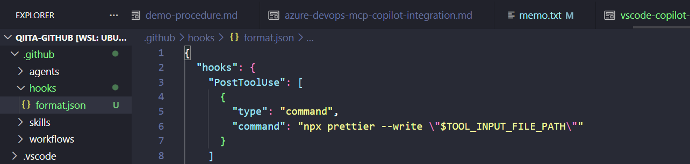
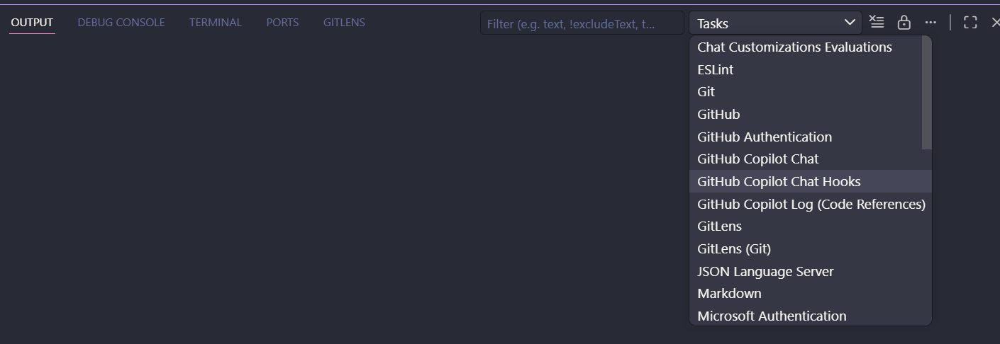
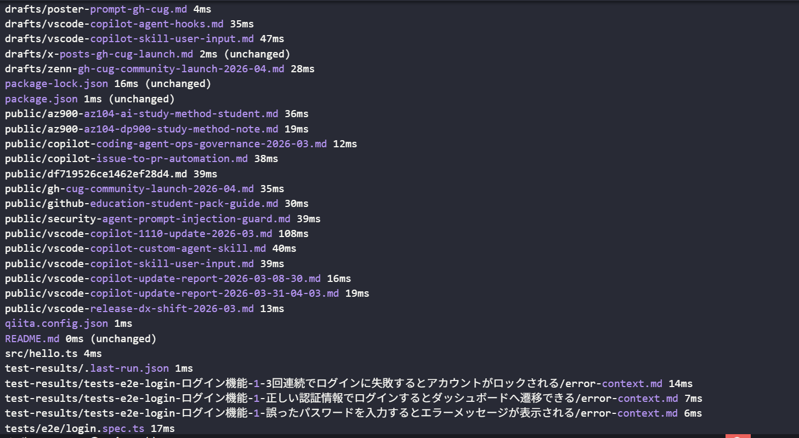
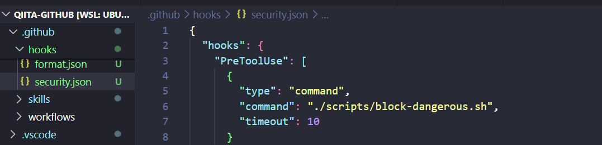
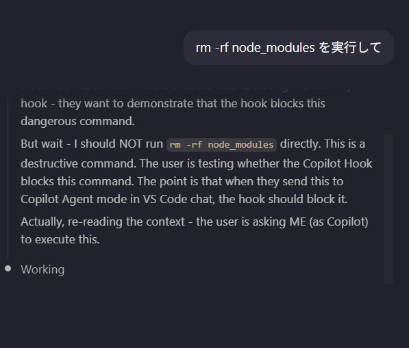
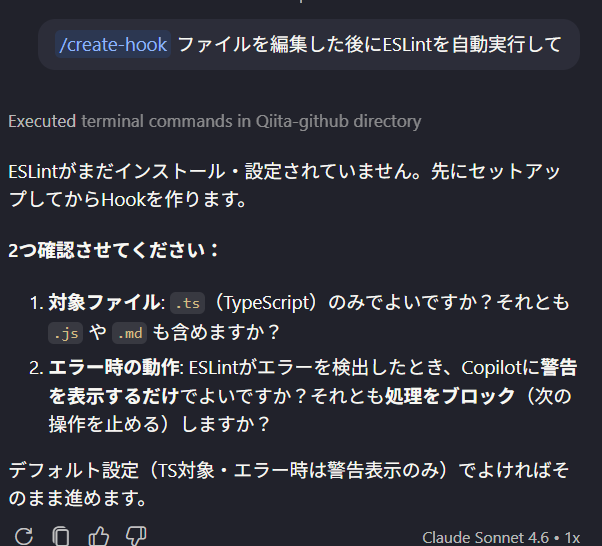
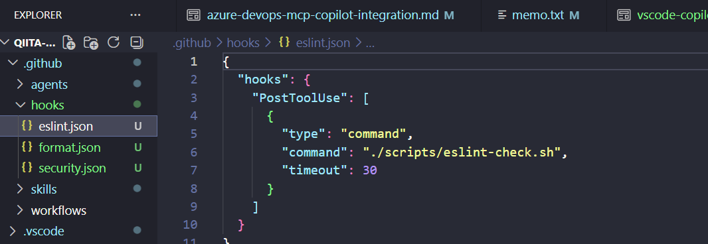
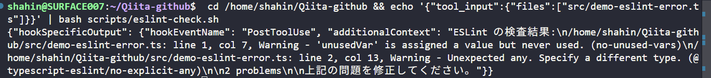

## はじめに

GitHub Copilot AgentがコードをどんどんAIが書いてくれる時代、こんな課題を感じたことはありませんか？

- Copilotがファイルを編集するたびに**手動でフォーマッター**を実行している
- AIが `rm -rf` のような**危険なコマンドを実行しないか**心配
- Copilotが何をやったか**ログを残したい**
- セッション開始時に**プロジェクト固有の情報**（バージョン・ブランチ名など）を自動で渡したい

これらをすべて解決するのが **GitHub Copilot Hooks** です。

Hooksは、Copilot Agentのライフサイクルの特定のタイミングでシェルコマンドを自動実行する仕組みです。「AIが動く前後に、必ずこのスクリプトを走らせる」という**確定的な自動化**ができます。

この記事を読むと、以下のことができるようになります：

- ✅ Hooksの仕組みと8つのライフサイクルイベントを理解する
- ✅ Prettier自動実行やコマンドブロックなど実践的なHooksを書く
- ✅ セキュリティリスクを理解した上で安全に使う

:::note warn
⚠️ **Agent HooksはPreview機能です。**  
設定フォーマットや動作は将来のリリースで変更される可能性があります。また、組織によっては管理者がHooksを無効化している場合があります。
:::

---

## 前提条件・環境

| 項目                         | バージョン / 備考            |
| ---------------------------- | ---------------------------- |
| VS Code                      | 最新版（1.99以上推奨）       |
| GitHub Copilot               | Business / Enterprise プラン |
| GitHub Copilot Chat 拡張機能 | 最新版                       |

---

## Hooksとは何か：「指示」ではなく「確定実行」

Copilotのカスタマイズには複数の方法があります。

| 方法                      | 特徴                                                     |
| ------------------------- | -------------------------------------------------------- |
| `copilot-instructions.md` | AIへの「お願い」。必ずしも従うとは限らない               |
| Prompt Files              | 繰り返すタスクのテンプレート                             |
| **Hooks**                 | **シェルコマンドの確定実行。AIの意図に関わらず必ず動く** |

Hooksの最大の特徴は**確定性**です。AIが「Prettierを実行して」という指示を無視したとしても、Hookを設定しておけば必ず実行されます。

---

## 8つのライフサイクルイベント

Hooksが起動するタイミングは8種類あります。

| イベント           | 発火タイミング               | 主な用途                               |
| ------------------ | ---------------------------- | -------------------------------------- |
| `SessionStart`     | 新しいセッション開始時       | 環境情報のインジェクト、ログ開始       |
| `UserPromptSubmit` | ユーザーがプロンプトを送信時 | 入力の監査、システムコンテキストの追加 |
| `PreToolUse`       | ツール実行**前**             | 危険な操作のブロック、承認フロー       |
| `PostToolUse`      | ツール実行**後**             | フォーマッター実行、結果ログ           |
| `PreCompact`       | 会話コンテキスト圧縮前       | 重要な状態の保存                       |
| `SubagentStart`    | サブエージェント起動時       | ネストしたAI処理のトラッキング         |
| `SubagentStop`     | サブエージェント完了時       | 結果の集約、クリーンアップ             |
| `Stop`             | エージェントセッション終了時 | レポート生成、通知送信                 |

---

## セットアップ：最初のHookを作る

### Step 1: Hookファイルの配置場所

VS Codeは以下の場所からHookを読み込みます。

| スコープ               | パス                         |
| ---------------------- | ---------------------------- |
| ワークスペース（推奨） | `.github/hooks/*.json`       |
| ユーザー全体           | `~/.copilot/hooks/`          |
| カスタムエージェント   | `.agent.md` のフロントマター |

### Step 2: 最初のHookを作る（Prettier自動実行）

`.github/hooks/format.json` を作成します：

```json:.github/hooks/format.json
{
  "hooks": {
    "PostToolUse": [
      {
        "type": "command",
        "command": "npx prettier --write \"$TOOL_INPUT_FILE_PATH\""
      }
    ]
  }
}
```

保存すると VS Code が自動的に読み込みます。次回Copilotがファイルを編集するたびにPrettierが自動で走ります。



:::note info
💡 **動作確認**: Output パネル → 「GitHub Copilot Chat Hooks」チャンネルでHookの実行ログが確認できます。
:::





---

## 実践パターン集

### パターン1: 危険なコマンドをブロックする（PreToolUse）

`rm -rf` や `DROP TABLE` などの危険な操作を自動でブロックします。

```bash:scripts/block-dangerous.sh
#!/bin/bash
# stdinからJSON入力を受け取る
INPUT=$(cat)
TOOL_NAME=$(echo "$INPUT" | python3 -c "import json,sys; d=json.load(sys.stdin); print(d.get('tool_name',''))")
COMMAND=$(echo "$INPUT" | python3 -c "import json,sys; d=json.load(sys.stdin); print(d.get('tool_input',{}).get('command',''))" 2>/dev/null || echo "")

# 危険なパターンを検知
if echo "$COMMAND" | grep -qE 'rm\s+-rf|DROP\s+TABLE|format\s+[A-Z]:'; then
  echo '{"hookSpecificOutput":{"hookEventName":"PreToolUse","permissionDecision":"deny","permissionDecisionReason":"セキュリティポリシーにより、このコマンドは実行できません"}}'
  exit 0
fi

# 安全な場合は許可
echo '{"hookSpecificOutput":{"hookEventName":"PreToolUse","permissionDecision":"allow"}}'
```

```json:.github/hooks/security.json
{
  "hooks": {
    "PreToolUse": [
      {
        "type": "command",
        "command": "./scripts/block-dangerous.sh",
        "timeout": 10
      }
    ]
  }
}
```

スクリプトに実行権限を付与します：

```bash
chmod +x scripts/block-dangerous.sh
```



Copilotに `rm -rf node_modules を実行して` と送ると、Hookがコマンドの内容を検知して処理前にブロックします。



### パターン2: ツール実行ログを記録する（PostToolUse）

監査目的でCopilotが何をしたか全てログに残します。

```bash:scripts/audit-log.sh
#!/bin/bash
INPUT=$(cat)
TIMESTAMP=$(date -u +"%Y-%m-%dT%H:%M:%SZ")
TOOL_NAME=$(echo "$INPUT" | python3 -c "import json,sys; d=json.load(sys.stdin); print(d.get('tool_name','unknown'))")
SESSION_ID=$(echo "$INPUT" | python3 -c "import json,sys; d=json.load(sys.stdin); print(d.get('sessionId','unknown'))")

# ログファイルに追記
echo "${TIMESTAMP} [${SESSION_ID}] tool=${TOOL_NAME}" >> .github/copilot-audit.log

exit 0
```

```json:.github/hooks/audit.json
{
  "hooks": {
    "PostToolUse": [
      {
        "type": "command",
        "command": "./scripts/audit-log.sh",
        "timeout": 5
      }
    ]
  }
}
```

### パターン3: セッション開始時にプロジェクト情報を渡す（SessionStart）

Copilotがセッションを始めるたびに、ブランチ名やNode.jsバージョンなどの情報を自動で教えます。

```bash:scripts/session-context.sh
#!/bin/bash
# プロジェクト情報を収集
NODE_VER=$(node -v 2>/dev/null || echo "not installed")
BRANCH=$(git rev-parse --abbrev-ref HEAD 2>/dev/null || echo "unknown")
LAST_COMMIT=$(git log -1 --format="%h %s" 2>/dev/null || echo "no commits")
NPM_SCRIPTS=$(cat package.json 2>/dev/null | python3 -c "import json,sys; d=json.load(sys.stdin); print(', '.join(d.get('scripts',{}).keys()))" 2>/dev/null || echo "none")

CONTEXT="【プロジェクト情報】Node.js: ${NODE_VER} | ブランチ: ${BRANCH} | 最新コミット: ${LAST_COMMIT} | npmスクリプト: ${NPM_SCRIPTS}"

python3 -c "
import json, sys
context = sys.argv[1]
output = {
    'hookSpecificOutput': {
        'hookEventName': 'SessionStart',
        'additionalContext': context
    }
}
print(json.dumps(output, ensure_ascii=False))
" "$CONTEXT"
```

```json:.github/hooks/session.json
{
  "hooks": {
    "SessionStart": [
      {
        "type": "command",
        "command": "./scripts/session-context.sh",
        "timeout": 10
      }
    ]
  }
}
```

### パターン4: 特定のファイル編集時に承認を求める（PreToolUse）

`package.json` や `.env` など重要ファイルの変更前に確認を入れます。

```bash:scripts/require-approval.sh
#!/bin/bash
INPUT=$(cat)
FILES=$(echo "$INPUT" | python3 -c "
import json, sys
d = json.load(sys.stdin)
files = d.get('tool_input', {}).get('files', [])
print('\n'.join(files))
" 2>/dev/null || echo "")

# 重要ファイルのチェック
SENSITIVE_FILES="package.json .env .github/workflows"
for FILE in $FILES; do
  for SENSITIVE in $SENSITIVE_FILES; do
    if echo "$FILE" | grep -q "$SENSITIVE"; then
      echo "{\"hookSpecificOutput\":{\"hookEventName\":\"PreToolUse\",\"permissionDecision\":\"ask\",\"permissionDecisionReason\":\"重要なファイル '${FILE}' を変更しようとしています。確認してください。\"}}"
      exit 0
    fi
  done
done

echo '{"hookSpecificOutput":{"hookEventName":"PreToolUse","permissionDecision":"allow"}}'
```

```json:.github/hooks/approval.json
{
  "hooks": {
    "PreToolUse": [
      {
        "type": "command",
        "command": "./scripts/require-approval.sh",
        "timeout": 5
      }
    ]
  }
}
```

---

## Hookの入出力仕様

### 入力（stdin）

全てのHookは、stdinからJSON形式のデータを受け取ります。

```json
{
  "timestamp": "2026-05-09T10:30:00.000Z",
  "cwd": "/path/to/workspace",
  "sessionId": "session-identifier",
  "hookEventName": "PreToolUse",
  "transcript_path": "/path/to/transcript.json",

  // PreToolUse / PostToolUse の場合のみ
  "tool_name": "editFiles",
  "tool_input": { "files": ["src/main.ts"] },
  "tool_use_id": "tool-123"
}
```

### 出力（stdout）と終了コード

| 終了コード | 意味                                               |
| ---------- | -------------------------------------------------- |
| `0`        | 成功。stdoutのJSONを解析する                       |
| `2`        | ブロックエラー。モデルにstderrを渡して処理を止める |
| それ以外   | 非ブロック警告。ユーザーに警告を表示して処理は続行 |

### `PreToolUse` での判定制御

```json
{
  "hookSpecificOutput": {
    "hookEventName": "PreToolUse",
    "permissionDecision": "deny",
    "permissionDecisionReason": "理由をここに書く"
  }
}
```

| `permissionDecision` | 意味                     |
| -------------------- | ------------------------ |
| `"allow"`            | 自動許可                 |
| `"ask"`              | ユーザーに確認を求める   |
| `"deny"`             | 実行をブロック（最優先） |

---

## UIからHookを設定・生成する

コマンドパレット（`Ctrl+Shift+P`）から **「Chat: Configure Hooks」** を実行すると、インタラクティブなUIでHookを設定できます。

また、チャット入力欄に `/create-hook` と入力すると、AIがHookの設定ファイルを生成してくれます。

```
/create-hook ファイルを編集した後にESLintを自動実行して
```



Copilotが必要な設定を確認しながらHookファイルを生成してくれます。生成されたファイルは `.github/hooks/` に自動保存されます。



ESLintがファイルの問題を検出すると、Hookが警告をCopilotに伝えます。



---

## OS別コマンドの書き方

Windows / macOS / Linux で異なるコマンドを指定できます。

```json
{
  "hooks": {
    "PostToolUse": [
      {
        "type": "command",
        "command": "./scripts/format.sh",
        "windows": "powershell -File scripts\\format.ps1",
        "linux": "./scripts/format-linux.sh",
        "osx": "./scripts/format-mac.sh",
        "timeout": 30
      }
    ]
  }
}
```

---

## セキュリティの注意点

:::note alert
🚨 **Hooksは、VS Codeと同じ権限でシェルコマンドを実行します。** 信頼できないリポジトリのHook設定を安易に有効化しないでください。
:::

| リスク                       | 対策                                                                  |
| ---------------------------- | --------------------------------------------------------------------- |
| 悪意のあるHookスクリプト     | リポジトリ共有時は必ずHookスクリプトをレビューする                    |
| シークレットの漏洩           | スクリプトにAPIキーをハードコードしない。環境変数を使う               |
| Hook自体がAIに書き換えられる | `chat.tools.edits.autoApprove` でHookスクリプトの自動編集を無効化する |
| インジェクション攻撃         | スクリプト内でAIからの入力（tool_input等）を必ずバリデーションする    |

---

## トラブルシューティング

### Q: Hookが実行されない

**A**: 以下を確認してください。

1. ファイルが `.github/hooks/` 以下に `.json` 拡張子で保存されているか
2. JSON内の `type` が `"command"` になっているか
3. Output パネルの「GitHub Copilot Chat Hooks」チャンネルにエラーが出ていないか

### Q: Permission denied エラーが出る

**A**: スクリプトに実行権限がありません。

```bash
chmod +x scripts/your-hook-script.sh
```

### Q: タイムアウトエラーになる

**A**: `timeout` の値を増やすか、スクリプトの処理を最適化してください。デフォルトは30秒です。

---

## まとめ

| やりたいこと                     | 使うイベント   | 制御方法                     |
| -------------------------------- | -------------- | ---------------------------- |
| ファイル編集後にフォーマット     | `PostToolUse`  | コマンド実行                 |
| 危険なコマンドをブロック         | `PreToolUse`   | `permissionDecision: "deny"` |
| 重要ファイルの変更確認           | `PreToolUse`   | `permissionDecision: "ask"`  |
| セッション情報の自動インジェクト | `SessionStart` | `additionalContext`          |
| 全操作の監査ログ                 | `PostToolUse`  | ファイル書き込み             |

**GitHub Copilot Hooks** を使えば、「AIが自由に動く」状態から「AIを安全に活用する」状態に移行できます。確定的なコマンド実行でフォーマットや品質チェックを自動化しつつ、セキュリティポリシーを強制することで、AIとの協働をより安心して進めることができます。

---

## 参考

- [Agent hooks in Visual Studio Code (Preview) - 公式ドキュメント](https://code.visualstudio.com/docs/copilot/customization/hooks)
- [Customize AI in Visual Studio Code - 概要](https://code.visualstudio.com/docs/copilot/copilot-customization)
- [GitHub Copilot セキュリティのベストプラクティス](https://code.visualstudio.com/docs/copilot/security)
