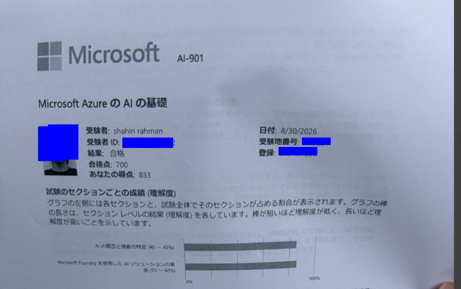
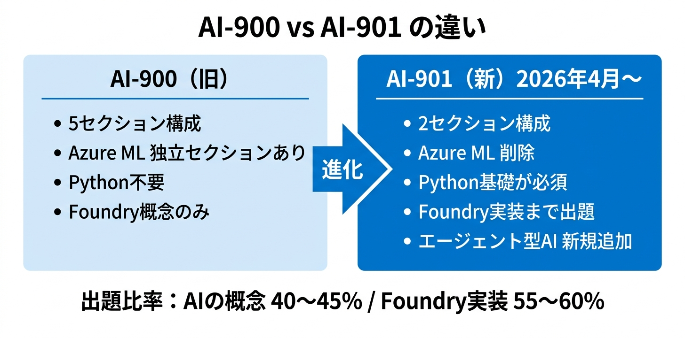
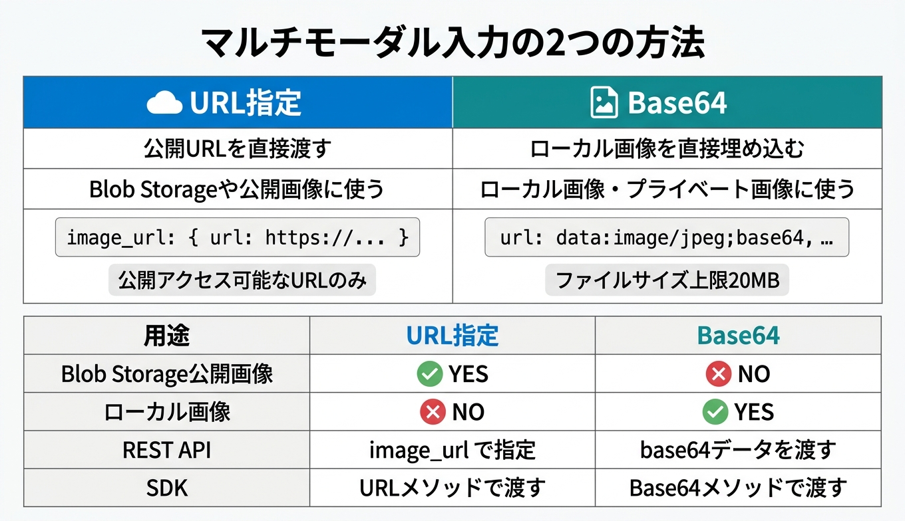

## はじめに

こんにちは！最近 Microsoft Student Ambassador になりましたロホマン シャヒンです！

情報学部2年・20歳で、現在はこんな感じで活動しています。

- Microsoft Student Ambassador（MSA）
- Azure Solutions Architect Expert 取得（計7種）
- Microsoftパートナー企業でインターン中
- GitHub Copilot User Group Japan 運営

詳しくはポートフォリオサイトもぜひ見てみてください！
https://shahin99991.github.io/Myportfolio/

:::note
この記事が少しでも参考になったら、**ぜひいいね・共有**をお願いします。
:::

2026年8月30日、AI-901（Microsoft Azure AI Fundamentals）に合格しました（得点：833/700）。実務でFoundryを触っている流れで、ちゃんと公式ドキュメントベースで学習しておきたいと思ったのがきっかけです。

AI-900の後継試験なんですが、内容がけっこう変わっていてちょっと驚きました。合格するまでの勉強法と、試験で感じた注意点をまとめておきます。

---

## AI-901とは？ — AI-900との違い

AI-901は**2026年4月15日にAI-900から更新された試験**です。試験コードが変わっただけでなく、出題構成と求められる知識のレベルが大きく変わっています。

### 試験の基本情報

| 項目         | 内容                            |
| ------------ | ------------------------------- |
| 試験コード   | AI-901                          |
| 正式名称     | Microsoft Azure AI Fundamentals |
| 合格点       | 700点（1000点スケール）         |
| 前提資格     | なし                            |
| 英語版更新日 | 2026年4月15日                   |

### AI-900 との主な差分

AI-900と比べて「概念を知っている」だけでは受からなくなりました。**Python構文・SDK・REST APIの基礎知識が明示的に必要**になっています。

| 観点                      | AI-900（旧）                 | AI-901（現行）                             |
| ------------------------- | ---------------------------- | ------------------------------------------ |
| **受験者像**              | 技術・非技術両方を対象       | AIソリューション開発キャリアの始まりを対象 |
| **前提知識**              | クラウドの基本程度（任意）   | Python・REST API・SDK の理解が**必須**     |
| **試験構成**              | 5セクション（各15〜25%）     | **2セクション**（40〜45% / 55〜60%）       |
| **Azure ML**              | 独立セクションで出題         | **削除**（ML概念は凝縮）                   |
| **主要プラットフォーム**  | Azure AI Foundry（概念のみ） | **Microsoft Foundry（実装まで）**          |
| **エージェント型AI**      | 記載なし                     | **新規追加**                               |
| **Content Understanding** | 記載なし                     | **新規追加**                               |

AI-900取得済みの方なら、**追加で学習が必要なのはFoundry関連の実装部分だけ**です。概念系はそのままカバーできます。

---

## 試験範囲と出題比率

出題は2セクションのみで、シンプルな構成になりました。

| セクション                                                   | 出題比率 |
| ------------------------------------------------------------ | -------- |
| **1. AIの概念と機能を特定する**                              | 40〜45%  |
| **2. Microsoft Foundryを使用してAIソリューションを実装する** | 55〜60%  |

**セクション1（AI概念）** では、責任あるAIの6原則・AIモデルのコンポーネント・生成AI・エージェント型AI・テキスト分析・音声・コンピュータービジョン・情報抽出などが出ます。

**セクション2（Foundry実装）** が新しい部分です。Foundryポータルでのモデルデプロイ、SDKを使ったチャットクライアントアプリ、単一エージェントの構築・テスト、マルチモーダル入力、Azure Content Understanding（ドキュメント・画像・音声からの情報抽出）が出題範囲に入っています。

試験全体の半分以上がFoundry関連なので、**Foundryをまったく触ったことがない方は一度ポータルを触っておくと理解がぐっと深まります**。

---

## 実際の勉強方法（合計約3時間）

正直なところ、AZ-900・AI-900・AZ-104・AZ-305などをすでに持っていて、Foundryも実際に触っていたので、勉強時間はかなり短くなりました。

### 使った教材

**① Microsoft Learn — 公式ラーニングパスを一周**

まず公式から始めました。[Introduction to AI in Azure](https://learn.microsoft.com/training/paths/introduction-to-ai-on-azure/) のラーニングパスが試験範囲に対応していて、セクション2（Foundry実装）の内容も含まれています。

Foundryを触ったことがある人は流し読みでも十分です。概念の整理に使いました。

**② Udemy 問題集**

[【うかる！】AI-901：Microsoft Azure AI Fundamentals 最強問題集](https://www.udemy.com/course/ai-901microsoft-azure-ai-fundamentals/) を一周しました。約1時間。

全体の正答率は**8割超え**でした。実際のスコアはこちら：

| 問題セット | 正答率 |
| ---------- | ------ |
| セット 1   | 95%    |
| セット 2   | 86%    |
| セット 3   | 81%    |
| セット 4   | 85%    |
| セット 5   | 92%    |

この問題集で8割を安定して取れていれば、本番試験でも合格ラインには届くと思います。

**③ AI Skills Navigator（公式模擬試験）**

Microsoft公式の [AI Skills Navigator](https://aiskillsnavigator.microsoft.com) でも事前に確認しました。問題の雰囲気と出題傾向をつかむのに使いました。

### 勉強時間の内訳

| 教材                              | 時間        |
| --------------------------------- | ----------- |
| Microsoft Learn（ラーニングパス） | 約1.5時間   |
| Udemy問題集                       | 約1時間     |
| AI Skills Navigator               | 約0.5時間   |
| **合計**                          | **約3時間** |

AI-900未取得の方や、AIの概念があまり馴染みがない方はもう少し時間をかけた方がいいと思います。ただ、**前提資格は一切必要ないファンダメンタルな試験**なので、Azureを使ったことがなくても十分に挑戦できます。

---

## 試験で難しかった部分

総合的にはそこまで難しくなかったんですが、引っかかりやすいポイントが2つありました。

### Pythonのコードを読む問題

コードを実行するわけではないですが、SDKの使い方・メソッドの引数・返り値の形式などを問う問題が出ます。Foundry SDKのコードをざっと読んでおくと安心です。

### マルチモーダル入力の方法（Image URL と Base64）

これが地味に引っかかりポイントでした。ビジョン対応モデルに画像を渡す方法が2種類あります。

| 方法        | 用途                              |
| ----------- | --------------------------------- |
| **URL指定** | Blob Storageや公開URLの画像を送る |
| **Base64**  | ローカル画像を直接埋め込む        |

REST APIでは `image_url` フィールドでURLまたは `data:image/jpeg;base64,...` 形式のデータを渡します。「どの場面でどちらを使うか」を整理しておくと問題でも迷いません。

---

## AI-901で学べるAI用語

試験勉強をしていて気づいたんですが、AI-901は**Azure特有のサービス名を覚えるだけの試験ではない**です。LLMやRAG、MCPなど、業界全体で使われる概念が体系的に出てくるので、Azureを普段触らない方にも意外と使える知識が身につきます！

試験範囲で登場する主要なAI用語をまとめておきます。

| カテゴリ       | 用語                                                                     |
| -------------- | ------------------------------------------------------------------------ |
| 基本概念       | LLM、Token、Context Window、Prompt                                       |
| 拡張・改善     | Grounding、RAG（Retrieval-Augmented Generation）、Fine-tuning、Embedding |
| 検索・取得     | Vector Search                                                            |
| 出力品質       | Hallucination                                                            |
| 自律型システム | Agent、Tool Calling、MCP（Model Context Protocol）                       |
| 入力形式       | Multimodal                                                               |
| 倫理・安全     | Responsible AI                                                           |

特にRAG・Agent・MCPあたりは最近の業界トレンドとも直結していて、試験勉強しながら「あ、これ実務でやってることだ」となる瞬間が多かったです。

---

## まとめ

- AI-901はAI-900の後継試験（2026年4月15日更新）。コードが変わっただけでなく、**Foundry実装が出題の55〜60%を占めるように**なった
- AI-900取得済みなら**Foundry関連の実装部分を重点的に学習すれば十分**
- 勉強時間は約3時間（Microsoft Learn + Udemy問題集）で合格できた（得点833）
- 難しかった部分は**Pythonコードの読み取り**と**マルチモーダル入力のURL/Base64の使い分け**
- AI-901は**Azureを触ったことがない方にもおすすめ**。現代のAI開発で使われる用語・概念が体系的に整理される

次に取得を目指しているのは**Azure AI Apps and Agents Developer Associate**です。また受かったら体験記を書きます！

---

## 参考

- [AI-901 試験詳細 — Microsoft Learn](https://learn.microsoft.com/ja-jp/credentials/certifications/exams/ai-901)
- [AI-901 学習ガイド（日本語） — Microsoft Learn](https://learn.microsoft.com/ja-jp/credentials/certifications/resources/study-guides/ai-901)
- [Microsoft Azure AI Fundamentals 認定資格 — Microsoft Learn](https://learn.microsoft.com/ja-jp/credentials/certifications/azure-ai-fundamentals/)
- [Microsoft Foundry 概要 — Azure ドキュメント](https://learn.microsoft.com/azure/foundry/what-is-foundry)
- [ビジョン対応チャットモデル（マルチモーダル） — Azure ドキュメント](https://learn.microsoft.com/azure/foundry/openai/how-to/gpt-with-vision)
- [Introduction to AI in Azure ラーニングパス — Microsoft Learn](https://learn.microsoft.com/training/paths/introduction-to-ai-on-azure/)
